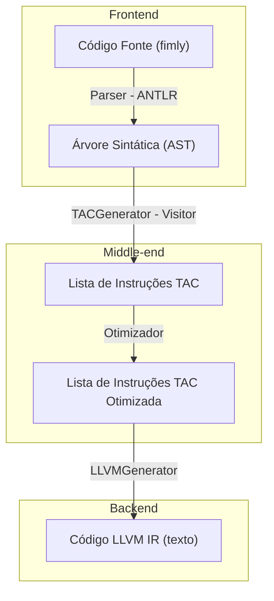
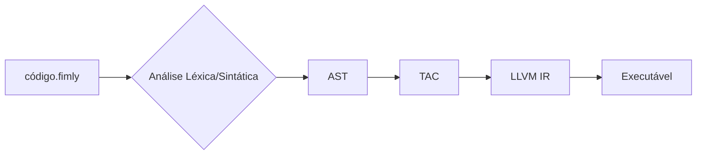
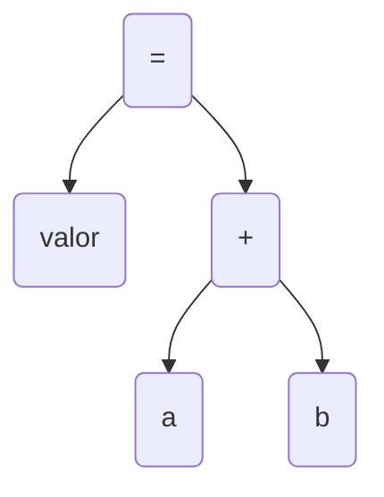

# Compilador - Fimly

Este repositório contém o desenvolvimento de um compilador para a linguagem **Fimly**, uma linguagem didática com sintaxe inspirada em **C** e **Portugol**. O nome é uma fusão de suas criadoras, **Emmylly** e **Filomena Soares**.

O projeto foi implementado em **Python** utilizando o **ANTLR4** para a análise léxica e sintática. O compilador realiza um fluxo completo, desde a leitura do código-fonte até a geração de código de baixo nível **LLVM IR**, que pode ser compilado para um executável nativo.

---

## Índice

1.  [Objetivo](#-objetivo)
2.  [Arquitetura e Design do Compilador](#️-arquitetura-e-design-do-compilador)
3.  [Fases do Compilador](#️-fases-do-compilador)
4.  [Gerenciamento de Símbolos e Tipos](#-gerenciamento-de-símbolos-e-tipos)
5.  [Gerenciamento de Entrada e Saída](#-gerenciamento-de-entrada-e-saída-io)
6.  [Linguagem Fimly](#-linguagem-fimly)
7.  [Tecnologias Utilizadas](#️-tecnologias-utilizadas)
8.  [Como Executar](#-como-executar)
9. [Exemplos de Uso](#-exemplos-de-uso)
10. [Autoras](#-autoras)

---

## Objetivo

O objetivo principal deste projeto é demonstrar o conhecimento prático sobre a construção de um compilador, cobrindo todas as suas fases clássicas:

-   **Análise Léxica:** Processar um arquivo `.fimly` e gerar uma sequência de tokens.
-   **Análise Sintática:** Validar a estrutura do código com base em uma gramática formal e gerar uma Árvore Sintática Abstrata (AST).
-   **Análise Semântica:** Validar declarações de variáveis e consistência de tipos.
-   **Geração de Código Intermediário:** Traduzir a AST para um Código de Três Endereços (TAC) otimizado.
-   **Geração de Código Alvo:** Traduzir o TAC para LLVM IR, um código de baixo nível, fortemente tipado e independente de plataforma.
-   **Compilação Final:** Utilizar o `clang` para compilar o LLVM IR em um executável nativo.

---

## Arquitetura e Design do Compilador

Este diagrama ilustra a arquitetura de múltiplos passos, mostrando como as representações intermediárias (AST e TAC) conectam as diferentes fases do compilador.



---

## Fases da Compilação

Este é um fluxograma simplificado que demonstra o processo completo de compilação, desde o arquivo-fonte até o executável final




**Fluxo de Geração do Código Intermediário**


**1. Codigo fonte**
O ponto de partida é uma linha de código simples que declara uma variável e atribui a ela a soma de outras duas.

```fimly
valor = a + b ;
```

**Fluxo de Geração do Código Intermediário**


**2. Geração da Árvore Sintática Abstrata (AST)**
O parser lê o código fonte e o transforma em uma AST. Para ```valor = a + b;```, a árvore representa a operação de atribuição como o nó principal.
A partir da AST (árvore de sintaxe abstrata), que mostra a estrutura lógica do nosso código.



**3. Geração do Código de Três Endereços (TAC)**
O TACGenerator percorre a AST e a converte em uma lista de instruções lineares e simples. Cada instrução tem no máximo um operador. Para isso, são usadas variáveis temporárias (como t0, t1, etc.).

Lista de Instruções TAC:
```
t0 = a + b
valor = t0
```
**Gerenciamento de variáveis e entrada/saída**
Variáveis: o código trata todas as variáveis como "operandos" (TACOperand), armazenando as variáveis.

READ : É a instrução que aguarda a inserção de um dado feito pelo usuário e armazena 

PRINT: é a instrução que pega o que está armazenado e mostre na tela

**Comunicação entre os arquivos**
Tac.py: este arquivo define o que é uma "instrução" (TACinstryction) e o que é um operando (TACOperand). Ele não se importa em como essas instruções são montadas, apenas como que elas são.

Tac_generator.py : este arquivo é o manual que ensina a como montar as instruções (definidas em tac.py) para construir o modelo final (lista de instruções TAC).

**4. Geração do Código LLVM IR (Backend)**
Finalmente, o LLVMGenerator consome a lista de instruções TAC e a traduz para o código LLVM IR. O LLVM IR é uma representação de baixo nível, parecida com Assembly, mas independente da arquitetura da máquina.

Código LLVM IR Gerado:
```
; %a, %b, e %valor são ponteiros para as posições de memória dessas variáveis (ex: i32*).

; 1. Carregar o valor da variável 'a' da memória para um registrador virtual.
%val_a = load i32, i32* %a, align 4

; 2. Carregar o valor da variável 'b' da memória para outro registrador virtual.
%val_b = load i32, i32* %b, align 4

; 3. Executar a instrução de soma (corresponde ao TAC 't0 = a + b').
;    'nsw' significa "No Signed Wrap", uma flag de otimização para inteiros com sinal.
%sum_temp = add nsw i32 %val_a, %val_b

; 4. Armazenar o resultado da soma na posição de memória da variável 'valor'.
;    (corresponde ao TAC 'valor = t0').
store i32 %sum_temp, i32* %valor, align 4
```

---


## Gerenciamento de Símbolos e Tipos
O gerenciamento de variáveis é realizado através de uma Tabela de Símbolos, implementada como um dicionário Python no LLVMGenerator. Ela funciona como o "caderno de anotações" do compilador.

**Estrutura:** ```self.var_map```

**Conteúdo:** Para cada variável, a tabela armazena seu ponteiro de memória e seu tipo.
```
# Exemplo para a declaração 'a : float;'
self.var_map['a'] = {'ptr': '%a', 'type': 'double'}
```
**Funcionamento:**

**Declaração:** O compilador gera a instrução alloca double para reservar espaço na memória e anota na tabela que %a é um ponteiro para um valor double.

**Uso:** Ao encontrar a + b, o compilador consulta a tabela. Ao ver que a ou b é double, ele sabe que deve gerar a instrução de soma de ponto flutuante (fadd), e não a de inteiros (add).

---

## Gerenciamento de Entrada e Saída
As funções leia e escreva da linguagem Fimly são implementadas fazendo uma ponte com a Biblioteca Padrão do C, que está disponível através do LLVM.

**escreva(...):** É traduzida para uma chamada à função C @printf. O LLVMGenerator seleciona a string de formato correta (%d para int, %f para float) com base no tipo do dado a ser impresso, consultado na Tabela de Símbolos.

**leia(...):** É traduzida para uma chamada à função C @scanf. É passado o formato esperado (%d ou %lf) e um ponteiro para a variável onde o valor lido será armazenado. O uso de %lf é crucial para a leitura correta de floats (que são double em LLVM).

| Funcionalidade     | Onde acontece    |  Comando Usado   |
|--------------------|------------------|------------------|
| Criar Variavel     | DECLR, ASSIGN, load_var | alloca    |
| Escrever valor na variavel  | ASSIGN  | store            |
| Ler valor da variavel | load_vr       | load             |
| Entrada de dados   | READ             | scanf + @scanf_fmt |
| Saida de dados     | PRINT            | print + @print_fmt|

---

## Linguagem Fimly
A seguir, estão listados os tokens reconhecidos pela linguagem Fimly, divididos por categorias:

### 📌 Palavras-chave

| Token     | Lexema     |
|-----------|------------|
| `INICIO`  | `inicio`   |
| `LEIA`    | `leia`     |
| `ESCREVA` | `escreva`  |
| `FIM`     | `fim`      |
| `SE`      | `se`       |
| `ENTAO`   | `entao`    |
| `SENAO`   | `senao`    |
| `ENQUANTO`| `enquanto` |
| `FACA`    | `faca`     |

### 🧩 Tipos de dados

| Token          | Lexema  |
|----------------|---------|
| `TIPO_INTEIRO` | `int`   |
| `TIPO_FLOAT`   | `float` |
| `TIPO_STRING`  | `string`|

### ➕ Operadores e Símbolos

| Token        | Símbolo |
|--------------|---------|
| `ADICAO`     | `+`     |
| `SUBTRACAO`  | `-`     |
| `DIVISAO`    | `/`     |
| `MULTIPLICA` | `*`     |
| `IGUAL`      | `==`    |
| `DIFERENTE`  | `!=`    |
| `MAIORIGUAL` | `>=`    |
| `MENORIGUAL` | `<=`    |
| `MAIOR`      | `>`     |
| `MENOR`      | `<`     |
| `ATRIBUICAO` | `=`     |
| `NAO`        | `!`     |
| `E`          | `&&`    |
| `OU`         | `||`    |

### 🧱 Delimitadores

| Token         | Símbolo |
|---------------|---------|
| `ABRE_PAR`    | `(`     |
| `FECHA_PAR`   | `)`     |
| `ABRE_CHAVE`  | `{`     |
| `FECHA_CHAVE` | `}`     |
| `DOIS_PONTOS` | `:`     |
| `PONTO_VIR`   | `;`     |
| `VIRG`        | `,`     |

### 🆔 Literais e Identificadores

| Token     | Padrão (Regex)                |
|-----------|-------------------------------|
| `ID`      | `[a-zA-Z_] [a-zA-Z_0-9]*`     |
| `INTEIRO` | `('0'..'9')+`                 |
| `FLOAT`   | `('0'..'9')+ '.' ('0'..'9')*` |
| `STRING`  | `"` ~["\\r\\n]* `"`           |

### 🧹 Espaços em branco e Comentários

| Token       | Descrição                     |
|-------------|-------------------------------|
| `COMENTARIO`| Comentário de linha `// ...` |
| `WS`        | Espaços, tabs e quebras de linha |

---

## Tecnologias Utilizadas

- Python 3.11: Linguagem principal para a implementação do compilador.
- Java: Necessário para o ANTLR
- ANTLR4: Ferramenta para gerar o analisador léxico e sintático a partir da gramática formal fimly.g4.
- Padrão Visitor: Utilizamos o padrão de projeto Visitor gerado pelo ANTLR para percorrer a AST e implementar a lógica do TACGenerator.
- LLVM (Low Level Virtual Machine): Uma infraestrutura de compiladores completa. Utilizamos sua Representação Intermediária (LLVM IR) como nosso código-alvo.
Vantagens: É fortemente tipado, possui um formato de assembly legível e nos dá acesso a um ecossistema de ferramentas fantástico como o interpretador lli e o compilador clang.
- Graphviz: Ferramenta para renderizar os arquivos .dot da AST em imagens .png.

---

## Como Executar
Com as ferramentas já instaladas:
1. **Instale as dependências:**
   ```bash
   pip install antlr4-python3-runtime
2. Gere o parser e lexer com ANTLR:
   ```bash
   antlr4 -Dlanguage=Python3 fimly.g4
3. Execute o compilador:
   ```bash
   python main.py codigo.fimly --gerar-tac --gerar-llvm --gerar-ast
4. Compile o código LLVM IR para executável
   - No prompt (mesmo ambiente onde rodou o passo anterior), execute:
   ```bash
   C:\Program Files\LLVM\bin\clang.exe" -target x86_64-pc-windows-msvc codigo.ll -o programa.exe -llegacy_stdio_definitions
    ```
   - Esse comando usa clang para gerar  ```programa.exe ``` a partir do  ```codigo.ll```.
   - A opção  ```-llegacy_stdio_definitions ``` é importante para resolver funções C padrão como  ```printf ``` e  ```scanf ```.

5. Execute o Programa
   ```bash
      programa.exe

---

## Exemplos de Uso
Classificação de Triângulos

**Código-Fonte (```triangulo.fimly```):**

```
a: float;
b: float;
c: float;

inicio
    escreva("Digite um valor para o lado a:");
    leia(a);
    escreva("Digite um valor para o lado b:");
    leia(b);
    escreva("Digite um valor para o lado c:");
    leia(c);

    se (a <= 0.0 || b <= 0.0 || c <= 0.0 || a + b <= c || a + c <= b || b + c <= a) {
        escreva("Medidas invalidas\n");
    } senao {
        se (a == b && b == c) {
            escreva("Triangulo equilatero valido\n");
        } senao {
            se (a == b || b == c || a == c) {
                escreva("Triangulo isosceles valido\n");
            } senao {
                escreva("Triangulo escaleno valido\n");
            }
        }
    }
fim
```
**Saída da Execução:**
```
Digite um valor para o lado a:1
Digite um valor para o lado b:1
Digite um valor para o lado c:3
Medidas invalidas
```

Triângulo de Pascal

**Código-Fonte (pascal.fimly):**
```n: int;
i: int;
j: int;
valor: int;
s: int;

inicio
    escreva("Digite o numero de linhas: ");
    leia(n);
    i = 0;
    enquanto (i < n) faca {
        s = 0;
        enquanto (s < n - i - 1) faca {
            escreva(" ");
            s = s + 1;
        }
        valor = 1;
        j = 0;
        enquanto (j <= i) faca {
            escreva(valor, " ");
            valor = valor * (i - j) / (j + 1);
            j = j + 1;
        }
        escreva("\n");
        i = i + 1;
    }
fim
```

**Saída da Execução (para n=5):**

```
Digite o numero de linhas: 5
    1 
   1 1 
  1 2 1 
 1 3 3 1 
1 4 6 4 1
```

## Autoras
- [Emmylly](https://github.com/EmmyllyDev)
- [Filomena Soares](https://github.com/FilomenaSoares)
